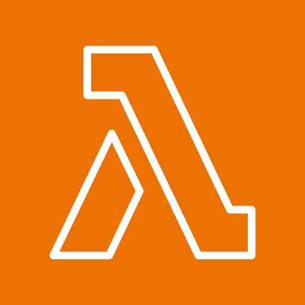
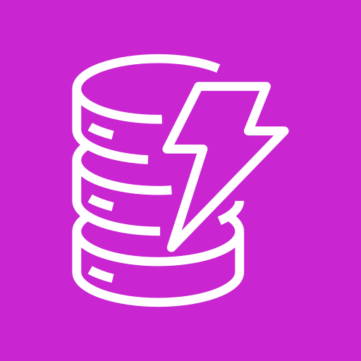

<!--column: 0-->
<!--newlines: 2-->
---
<!--column: 1-->
# AWS
<!--newline-->
---
<!--column: 2-->
<!--newlines: 2-->
---
<!--column: 0-->
<!--pause-->
<!--newline-->

<!--column: 1-->
<!--pause-->
<!--newline-->

<!--column: 2-->
<!--pause-->
<!--newline-->

<!--column: 0-->
<!--pause-->
<!--newline-->

<!--column: 1-->
<!--pause-->
<!--newline-->

<!--column: 2-->
<!--pause-->
<!--newline-->

